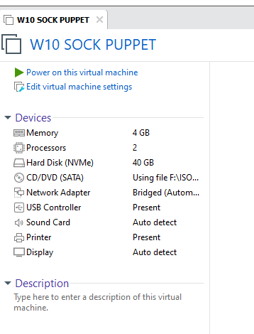
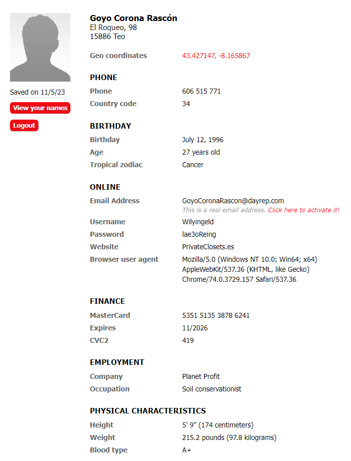

author: Pablo Painceiras Martinez
summary: En este codelab quedan expuestos diferentes mecanismos de protección de BIOS/UEFI.
id: Sock Puppet
categories: codelab,markdown,BIOS,cybersecurity
environments: Web
status: Published
feedback link:
analytics account: ID de Google Analytics

# SOCK PUPPET

## ¿Qué es un Sock Puppet?

Un "sock puppet" es un término que se utiliza en línea para referirse a una identidad falsa o una cuenta ficticia creada y controlada por una persona real con el propósito de engañar o manipular a otros en un foro de discusión, redes sociales u otras plataformas en línea. Estas cuentas suelen ser utilizadas para diversos fines, como promover una agenda personal, difamar a alguien, respaldar o atacar a ciertas personas o causas, o crear la ilusión de apoyo o consenso en torno a un tema.

El uso de sock puppets es generalmente visto como una forma de manipulación y deshonestidad en línea, y muchas comunidades en línea tienen reglas y políticas para detectar y evitar la creación y el uso de cuentas falsas.

¿En que se usan los sock puppet?

Los sock puppets se suelen usar en línea para una variedad de propósitos, algunos de los cuales pueden ser perjudiciales o engañosos. 

Algunos de los usos más comunes de los sock puppets incluyen:

1. Manipulación de opiniones: Las personas pueden crear sock puppets para tratar de influir en la opinión pública o en la percepción de un tema, producto, servicio o persona.
2. Trolleo y acoso en línea: Algunas personas utilizan sock puppets para acosar, intimidar o molestar a otros usuarios en línea sin ser identificados fácilmente.
3. Apoyo falso: Los sock puppets pueden ser utilizados para dar la apariencia de apoyo a una causa, producto o idea.
4. Difamación y desprestigio: Algunas personas pueden utilizar sock puppets para difamar o desprestigiar a otros, publicando información falsa o negativa sobre ellos de manera anónima o encubierta.
5. Falsificación de identidad: Los sock puppets a menudo implican la creación de identidades completamente falsas, incluyendo nombres, fotos de perfil y detalles personales, lo que dificulta que los demás identifiquen la verdadera identidad detrás de la cuenta.

## Mi Sock Puppet

### Preparación de un entorno seguro

Para crear y utilizar un sock puppet de manera discreta, es importante tener un entorno separado y aislado que no esté vinculado a un dispositivo personal. Una opción ideal sería utilizar un portátil dedicado exclusivamente a esta tarea, pero si no tienes los recursos para hacerlo, puedes utilizar una máquina virtual en tu propio ordenador

En este caso usaré una maquina virtual de Windows para llevar a cabo la creación.

Después de configurar la máquina virtual segura, es importante tomar medidas para evitar que te rastreen en línea. Para lograrlo, he optado por utilizar una VPN (Red Privada Virtual), en este caso, he escogido "Proton VPN" debido a que su versión gratuita nos permite conectarnos sin restricciones de datos. Sin embargo, el unico impedimento es que no podemos seleccionar la ubicación desde la cual nos conectamos, ya que la conexión gratuita nos asigna automáticamente un servidor especifico. Esto se podría solucionar fácilmente si nos suscribieramos a una VPN de pago que nos permita elegir desde dónde queremos conectarnos.

Para poder descargar el software, hemos tenido que crear una dirección de correo electrónico falsa. No podemos utilizar Gmail debido a que requiere verificar nuestra cuenta con un número de teléfono móvil, y queríamos mantener el mayor anonimato posible. En su lugar, creamos una cuenta en PROTON Mail, ya que esta plataforma tiene su sede en Suiza, lo que nos proporciona una mayor protección de nuestros datos debido a las estrictas leyes de privacidad que rigen en ese país.

En el caso de que tengamos un móvil desechable o de prepago podríamos usar una correo electrónico en donde se requiera una verificación por teléfono.

### Creación del perfil

Una vez que hemos completado todos los preparativos, procedemos a crear un perfil falso. En este caso, utilizamos un sitio web, [Fake Name Generator](https://www.fakenamegenerator.com/gen-male-sp-sp.php?s=6493c501-8994-4262-bd65-a34ca6d6ee43), que genera de manera aleatoria información de una persona siguiendo ciertos parámetros. Podemos seleccionar detalles como la raza, género y el rango de edad que deseamos que tenga nuestro personaje.

Una vez que hemos obtenido el tipo de perfil que nos interesa, esto nos sirve como una referencia sobre cómo será nuestro personaje ficticio. Siempre tienes la opción de ajustar algunos de estos parámetros por ti mismo para que el perfil se asemeje lo más posible al objetivo que tenemos en mente.

En mi caso tenemos a Goyo Corona Rascón, de 27 años y viviendo en A Coruña.

Una vez que hemos creado el perfil, necesitamos tener una cara. Dado que la mayoría de las inteligencias artificiales que generan rostros hiperrealistas son de pago y no hemos encontrado una amplia selección de opciones, recurrimos al sitio web [thispersondoesnotexist.com](http://thispersondoesnotexist.com/). Este sitio genera una imagen facial aleatoria cada vez que refrescamos la página. Hemos estado actualizando la página repetidamente hasta encontrar una imagen que consideramos adecuada para nuestro personaje ficticio.

### Actividad en la redes sociales

En este ejemplo, nos enfocamos en la plataforma [x.com](http://x.com/). Creamos una cuenta utilizando nuestra nueva identidad y comenzamos a seguir a otras cuentas que reflejan los intereses de nuestro nuevo personaje. Dado que hemos configurado sus preferencias para que incluyan el cuidado naturaleza (tanto animal como la vegetal) y el senderismo, he decidido seguir diversas cuentas relacionadas con estos sectores.

Una vez que hemos llegado a este punto, simplemente debemos mantener una actividad en línea como si fuéramos una persona real. Esto implica comentar en publicaciones, interactuar con otras cuentas y construir una vida en torno a esta identidad ficticia. A medida que avanzamos, nos acercamos cada vez más al objetivo para el cual creamos este perfil.

## Conclusión sobre los desafíos encontrados

En el proceso inicial, me enfrenté a varias dificultades. Una de las principales se presentó con la VPN, ya que la mayoría de ellas son de pago o tienen límites diarios en el uso de datos. En el caso de Proton VPN, no hay límites de datos, pero no permite seleccionar la región desde la cual se establece la conexión VPN. Por lo tanto, durante esta prueba, hemos estado conectados a través de Países Bajos. Esta limitación podría resolverse fácilmente adquiriendo una VPN de pago, que brinda la libertad de elegir la región y no tiene restricciones de datos.

Otra dificultad que enfrenté fue la generación de la imagen facial para nuestro perfil. La mayoría de las IA que generan rostros realistas son de pago, y las opciones gratuitas a menudo producen imágenes caricaturescas. Por lo tanto, tuve que recurrir a un sitio web que genera imágenes de forma aleatoria y seguir actualizándolo hasta encontrar la imagen adecuada para nuestro perfil.

Además, me encontré con el obstáculo de las redes sociales y plataformas que requieren un número de teléfono para el registro. Dado que no tenía un teléfono con una tarjeta SIM disponible, no pude utilizar este método, como ocurre, por ejemplo, con Gmail. Una solución para esto sería adquirir un teléfono a través de Amazon, utilizando un punto de recogida y una tarjeta virtual para hacer la compra de manera anónima.

Otra dificultad surgió en las redes sociales, ya que, al ser una persona "nueva" sin amigos en estas plataformas, resultó más complicado que las personas creyeran que era una persona real y no un "bot". Interactuar con otras cuentas también representó un desafío en este sentido.